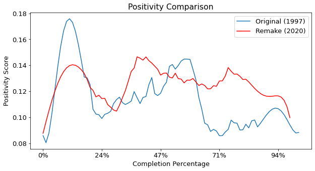
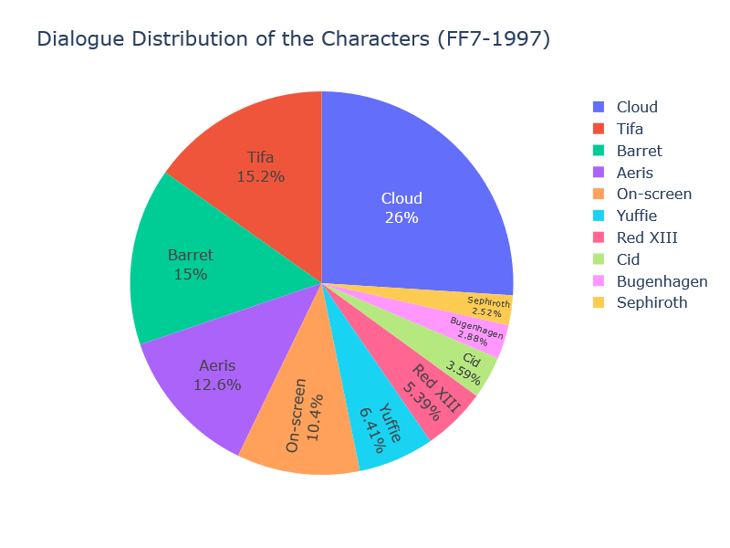
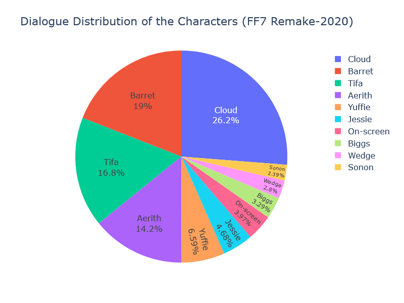

# Sentiment Analysis of _Final Fantasy VII_ and _Final Fantasy VII Remake_ (with Comparison)

A quick note: I was working on this project while Final Fantasy VII celabrating its 25th anniversary (June 16th, 2022). That was a nice little coincidence. 😊

## Introduction

First of all, I would like to clarify what Final Fantasy is for those who haven't heard it before. Final Fantasy VII is a JRPG (Japanese role playing video game) developed by Square Enix (formerly _Squaresoft_) released in 1997 for the PlayStation console. It is the seventh main installment in the Final Fantasy series. The game's story follows Cloud Strife, a mercenary who joins an eco-terrorist organization to stop a world-controlling megacorporation from using the planet's life essence as an energy source [1]. This game got remade in 2020 with new gameplay and latest graphics.

I wanted to make a Natural Language Processing (NLP) related project and while I was researching Sentiment Analysis piqued my interest. So I decided to make the project on this topic. Afterwards, I came across this great paper titled [_Analyzing Movie Scripts as Unstructured Text_](https://www.researchgate.net/publication/317558629_Analyzing_Movie_Scripts_as_Unstructured_Text) [2]. This paper is the main inspiration for my project.

Then I found the dialogue scripts of Final Fantasy series perfectly compiled on Kaggle by Tyler Huxtable and start working on the project [3]. Here's a [link](https://www.kaggle.com/datasets/tylerhuxtable/final-fantasy-dialogue-scripts) to the dataset.

## Project Goals

- Measure the sentimental intensity of the dialogues in these two games. With the help of NLTK (Natural Language Toolkit) we can measure statements' positivity, negativity and neutrality scores

- Inspect the course of storyline in terms of positivity and negativity of the dialogues

- Compare the positivity of the narration between the original game (1997) and the remake (2020)

## Sentiment Analysis with Vader Module from NLTK

I've used _nltk.sentiment.vader_ [4] to measure the games' lines' positivity, negativity and neutrality scores. You can find the source code of the module [here](https://www.nltk.org/_modules/nltk/sentiment/vader.html) [5].

There are about 6000 lines of dialogue in FF7 and 8000 in FF7 Remake. I got the sentimental intensity of these lines and smooth the result a bit to see the trend more easily. Here's a graph comparing the two games.

These two graphs show the dialogue distribution of the characters.

More details are on the Jupyter Notebook... 🏃‍♂️
 

## References

1. "Final Fantasy VII - Wikipedia". https://en.wikipedia.org/wiki/Final_Fantasy_VII

1. Lee, Seong-Ho & yu, hye yeon & Cheong, Yun-Gyung.(2017). Analyzing Movie Scripts as Unstructured Text. 249-254. 10.1109/BigDataService.2017.43.

1. "Final Fantasy Dialogue Scripts | Kaggle". https://www.kaggle.com/datasets/tylerhuxtable/final-fantasy-dialogue-scripts

1. Hutto, C.J. & Gilbert, E.E. (2014). VADER: A Parsimonious Rule-based Model for Sentiment Analysis of Social Media Text. Eighth International Conference on Weblogs and Social Media (ICWSM-14). Ann Arbor, MI, June 2014.

1. "NLTK :: nltk.sentiment.vader". https://www.nltk.org/_modules/nltk/sentiment/vader.html
